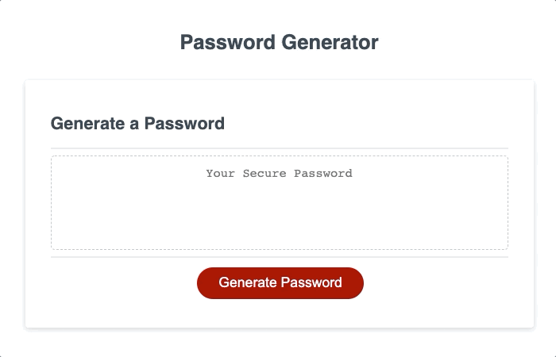

# password-generator
## easy to use!  
\
<!-- Instructions for use -->
Create a password of any length between 8 and 20 characters, including your choice of uppercase, lowercase, numeric, and special characters. 
\ 

<!-- Statement of purpose -->
## Purpose
Creating secure passwords is easier using this app, encouraging users toward a safer digital experience. 

## Technology utilized to create this page:
<!-- JavaScript Pionts -->
* JavaScript
    * Functions and nested functions
    * Arrays and iterative loops
    * Concatenation and push

    <!-- CSS Points -->
* CSS
    * Mouse hover event listener

<!-- Browser compatiblity -->
## Compatiblity and Installation
This HTML website, its CSS style document, and its JavaScript file were created and tested for Chrome, but will load in any browser.  Most modern browsers should play the content of this page as intended, and without issue.

## Credits:
UCBerkeley Code Camp, w3schools.com, developer.mozilla.org

## License
GNU General Public License v3.0

## Badges
